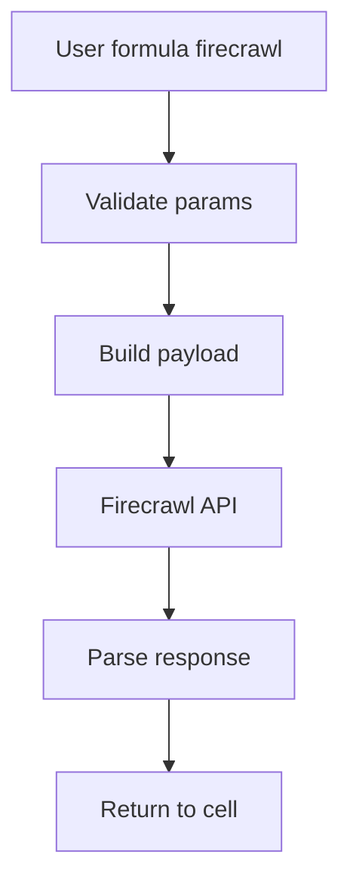

# Analýza: Firecrawl API návrh integrace pro Google Sheets

## 📌 Cíl dokumentu

Navrhnout funkci `=firecrawl()` pro Google Sheets včetně:

- návrhu parametrů
- mapování na Firecrawl endpointy
- doporučených modelů a formátů odpovědí
- návrhu návratové struktury
- uživatelských příkladů

Dokument je koncipován tak, aby šel následně převést do implementace v Apps Script podobně jako stávající integrace v `Perplexity.gs` a `Code.gs`.

---

## ✅ Shrnutí Firecrawl API

Firecrawl je API zaměřené na převod webových stránek na data připravená pro LLM. Primárně podporuje:

- převod do **Markdown**, **HTML** a **JSON**
- extrakci strukturovaných dat pomocí LLM
- vyhledávání a crawling webu
- agentní mód, který kombinuje search + scrape

Hlavní endpointy:

| Endpoint | Účel | Vstup | Výstup |
|---------|------|-------|--------|
| `/v2/scrape` | Jedna URL | URL | Markdown, HTML, JSON, metadata |
| `/v2/crawl` | Více URL | Start URL + pravidla | Kolekce dokumentů |
| `/v2/map` | Struktura webu | URL | Seznam URL |
| `/v2/search` | Web search | Query | Výsledky + volitelný scrape |
| `/v2/agent` | Autonomní agent | Prompt | Výsledek + sources |

---

## 🎯 Návrh funkce `=firecrawl()`

### Syntaxe

```
=firecrawl(prompt, endpoint, target, model, formats, limit, options_json, password, response_field)
```

### Parametry

| Parametr | Typ | Povinný | Popis | Výchozí |
|---------|-----|---------|-------|---------|
| `prompt` | string | ✅ | Prompt nebo query | - |
| `endpoint` | string | ❌ | scrape, crawl, map, search, agent | agent |
| `target` | string | ❌ | URL (scrape/crawl/map) | - |
| `model` | string | ❌ | Firecrawl model | spark-1-mini |
| `formats` | string | ❌ | `markdown,html,json` | markdown |
| `limit` | number | ❌ | limit výsledků search/crawl | 5 |
| `options_json` | string | ❌ | JSON string s pokročilými parametry | - |
| `password` | string | ❌ | konfigurační heslo | - |
| `response_field` | string | ❌ | vrácené pole z JSON odpovědi | data |

### Základní logika

- pokud `endpoint` není zadán → použije se `agent`
- `prompt` je vždy povinný
- `target` je povinný pro `scrape`, `crawl`, `map`
- `options_json` umožní přenést libovolné Firecrawl parametry
- `response_field` umožní vracet jen vybranou část výstupu

---

## 🧭 Mapování na endpointy

### 1) `/v2/agent`

| Parametr | Použití |
|---------|---------|
| `prompt` | `prompt` |
| `model` | `model` |
| `formats` | `formats` |
| `options_json` | další parametry |

**Příklad payload:**

```json
{
  "prompt": "Najdi oficiální dokumentaci k API Firecrawl",
  "model": "spark-1-mini",
  "formats": ["markdown"]
}
```

### 2) `/v2/scrape`

| Parametr | Použití |
|---------|---------|
| `target` | `url` |
| `prompt` | `prompt` pro JSON extrakci |
| `formats` | `formats` |
| `model` | `model` |

**Příklad payload:**

```json
{
  "url": "https://example.com",
  "formats": ["markdown", "json"],
  "prompt": "Extract title, price, availability"
}
```

### 3) `/v2/search`

| Parametr | Použití |
|---------|---------|
| `prompt` | `query` |
| `limit` | `limit` |
| `formats` | `scrape_options.formats` |
| `options_json` | `sources`, `categories`, `tbs` |

**Příklad payload:**

```json
{
  "query": "nejnovější trendy v AI",
  "limit": 3,
  "scrape_options": { "formats": ["markdown"] }
}
```

### 4) `/v2/crawl`

| Parametr | Použití |
|---------|---------|
| `target` | `url` |
| `limit` | `limit` |
| `options_json` | `include_paths`, `exclude_paths`, `max_depth` |

### 5) `/v2/map`

| Parametr | Použití |
|---------|---------|
| `target` | `url` |
| `limit` | `limit` |

---

## 🤖 Doporučené modely

Firecrawl má vlastní modely (např. Spark). Doporučení:

- `spark-1-mini` → rychlý a levný
- `spark-1` → vyvážený
- `spark-1-pro` → kvalitnější výstupy

Model by měl být předáván jako string bez tvrdé validace v první verzi.

---

## 🧱 Návrh návratové struktury

Výchozí návrat by měl být **textový** (aby fungoval v jedné buňce), ale umožnit volbu `response_field`.

### Návrh chování

- pokud `response_field` není zadán → vrátí hlavní text
- pokud `response_field` je `sources` → vrátí seznam URL
- pokud `response_field` je `data` → vrátí JSON string

**Příklad návratu:**

```
Výsledek:
...text...

Sources:
1. https://...
2. https://...
```

---

## 🔐 Bezpečnost a čerpání kreditů

### Bezpečnostní doporučení

- **API klíč ukládat pouze do** `PropertiesService` a nikdy nepsat do buněk.
- **Heslo pro nastavení klíče** držet v konfiguraci skriptu podobně jako v `Perplexity.gs`.
- **Logování chyb** bez citlivých dat (neukládat API klíč, celé payloady ani osobní údaje).
- **Omezit rozsah funkcí** na domény, které uživatel potřebuje (např. přes `include_paths`).
- **Validovat vstupy**: nepovolit prázdné `prompt` a kontrolovat délky textů.

### Čerpání kreditů (nákladová strategie)

- **Nejlevnější** je obvykle `map` (jen seznam URL).
- **Nejdražší** je `crawl` a `search` se scrapem více stránek.
- **Agent** je komfortní, ale může spouštět více kroků → vyšší spotřeba.

Praktické tipy pro kontrolu kreditu:

1. **Začněte `map` → vyberte URL → pak `scrape`.**
2. **Používejte `limit`** (např. 3–5) a postupně navyšujte.
3. **Preferujte `spark-1-mini`** pro rutinní dotazy.
4. **U `crawl` nastavujte `include_paths` a `max_depth`.**
5. **Pro často opakované dotazy ukládejte výsledky do buněk** a nepřepočítávejte zbytečně.
6. **Vyhněte se scrape celé stránky, když stačí vybraná část.**

---

---

## 🧪 Příklady použití v Google Sheets

### 1) Agentní dotaz

```
=firecrawl("Najdi hlavní endpointy Firecrawl API", "agent", , "spark-1-mini", "markdown", , , "mojeHeslo")
```

### 2) Scrape jedné stránky

```
=firecrawl("Extract title and pricing", "scrape", "https://firecrawl.dev/pricing", "spark-1", "json", , , "mojeHeslo")
```

### 3) Search s extrakcí Markdownu

```
=firecrawl("nejnovější trendy v AI", "search", , "spark-1-mini", "markdown", 3, , "mojeHeslo")
```

### 4) Crawl celého webu

```
=firecrawl("Crawl docs", "crawl", "https://firecrawl.dev", , "markdown", 10, "{\"include_paths\":[\"/docs\"]}", "mojeHeslo")
```

### 5) Mapování webu

```
=firecrawl("Map site", "map", "https://firecrawl.dev", , , 50, , "mojeHeslo")
```

### 6) Vrácení pouze zdrojů

```
=firecrawl("Najdi 3 zdroje o Firecrawl", "agent", , , , 3, , "mojeHeslo", "sources")
```

---

## 💼 Praktické scénáře pro sales a marketing (10–15 příkladů)

### 1) Najít hlavního pořadatele eventu

```
=firecrawl("Zjisti hlavního pořadatele a kontakt pro event WebExpo 2024", "agent", , "spark-1-mini", "markdown", , , "mojeHeslo")
```

### 2) Identifikace rozhodovatele (About/Leadership)

```
=firecrawl("Najdi CEO a Head of Sales", "scrape", "https://firma.cz/about", , "markdown", , , "mojeHeslo")
```

### 3) Extrakce kontaktního emailu z webu

```
=firecrawl("Najdi email pro obchodní oddělení", "scrape", "https://firma.cz/kontakt", , "markdown", , , "mojeHeslo")
```

### 4) Shrnout nabídku služeb konkurenta

```
=firecrawl("Shrň služby a cenové plány", "scrape", "https://konkurent.cz/pricing", "spark-1", "markdown", , , "mojeHeslo")
```

### 5) Vyhledat nové leady podle oboru

```
=firecrawl("B2B marketing agentura Praha", "search", , "spark-1-mini", "markdown", 5, , "mojeHeslo")
```

### 6) Ověření partnerství na webu klienta

```
=firecrawl("Zjisti, s kým spolupracují nebo partnerství", "scrape", "https://klient.cz/partners", , "markdown", , , "mojeHeslo")
```

### 7) Najít případové studie a reference

```
=firecrawl("Najdi případové studie a reference", "scrape", "https://firma.cz/case-studies", , "markdown", , , "mojeHeslo")
```

### 8) Zmapovat všechny produktové stránky

```
=firecrawl("Map product pages", "map", "https://firma.cz", , , 50, "{\"include_paths\":[\"/produkty\"]}", "mojeHeslo")
```

### 9) Získat ceník nebo pricing model

```
=firecrawl("Extrahuj ceník", "scrape", "https://firma.cz/cenik", "spark-1-mini", "markdown", , , "mojeHeslo")
```

### 10) Přehled klíčových benefitů z landing page

```
=firecrawl("Vypiš hlavní benefity produktu", "scrape", "https://firma.cz/landing", , "markdown", , , "mojeHeslo")
```

### 11) Analýza messagingu konkurenta

```
=firecrawl("Shrň positioning a value proposition", "scrape", "https://konkurent.cz", "spark-1", "markdown", , , "mojeHeslo")
```

### 12) Získat seznam poboček z webu

```
=firecrawl("Najdi seznam poboček", "scrape", "https://firma.cz/pobocky", , "markdown", , , "mojeHeslo")
```

### 13) Srovnání cen tří konkurentů

```
=firecrawl("Porovnej ceny 3 hlavních konkurentů", "agent", , "spark-1", "markdown", , , "mojeHeslo")
```

### 14) Hledání relevantních konferencí

```
=firecrawl("Najdi konference o kyberbezpečnosti v EU", "search", , "spark-1-mini", "markdown", 5, , "mojeHeslo")
```

### 15) Získání seznamu partnerů z webu eventu

```
=firecrawl("Najdi partnery nebo sponzory eventu", "scrape", "https://event.cz/partners", , "markdown", , , "mojeHeslo")
```

---

## 🧩 Integrace do stávajícího projektu

Doporučená implementace:

- nový soubor `Firecrawl.gs`
- konfigurace API klíče přes `PropertiesService`
- menu `Firecrawl` v UI
- podobné logování jako v `Perplexity.gs`

### Návrh struktury souboru

```
Firecrawl.gs
├── Konfigurace
│   ├── FIRECRAWL_API_URL
│   ├── FIRECRAWL_CONFIG_PASSWORD
│   ├── FIRECRAWL_DEFAULT_MODEL
│   ├── FIRECRAWL_DEFAULT_FORMATS
│   └── FIRECRAWL_ALLOWED_MODELS
│
├── Hlavní funkce
│   └── firecrawl(...)
│
├── API volání
│   └── callFirecrawlAPI(...)
│
├── Validace
│   └── validateFirecrawlParameters(...)
│
├── Logování
│   └── logFirecrawlError(...)
│
└── UI menu
    ├── onOpen()
    ├── showSetFirecrawlApiKeyDialog()
    └── showFirecrawlHelp()
```

---

## 🔄 Tok dat (Mermaid)



---

## ✅ Doporučení pro implementaci

1. **Začít s endpointem `/agent`** kvůli jednoduchosti
2. **Podporovat `options_json`** jako rozšiřitelný mechanismus
3. **Vrátit formátovaný text** pro jednoduché použití
4. **Doplnit možnost `response_field`** pro pokročilé uživatele
5. **Převzít styl validací a logování** z `Perplexity.gs`

---

## 📌 Shrnutí návrhu

- Jedna univerzální funkce `=firecrawl()` s parametrem `endpoint`
- Podpora všech hlavních Firecrawl endpointů
- Konfigurovatelné modely a formáty výstupu
- Přehledné chování pro běžné i pokročilé uživatele
